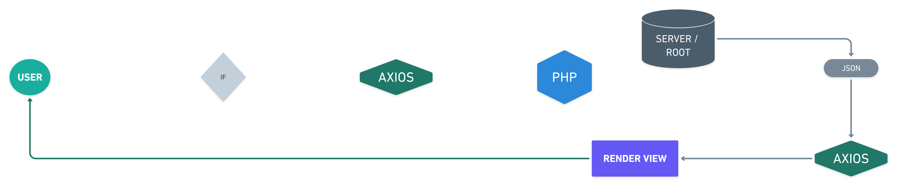

# LOCAL FILE SYSTEM

In this project you will have to create a system file explorer that allows the 
user to navigate, create directories and upload files in the same way as he 
would in his usual operating system.  

The file explorer is a tool that allows you to directly view and manipulate the
files and directories associated with a path, so you must take into account from
which path the user starts and which path they can access.  

## MAIN OBJECTIVES

1. Understand how the file system works
2. Improve your knowledge in PHP
3. Improve your knowledge in HTML, CSS & Javascript 
4. Improve your knowledge in logic and programming

## PROJECT REQUIREMENTS

- [ ] Create, modify and delete directories
- [ ] Browse through directories from an initial path
- [ ] The initial path will start from a folder inside the project repository whose
name will be "root".
- [ ] Search directories and files by name
- [ ] In the case of searching for files by name, you must also be able to specify
their extension as part of the name.
- [ ] Navigate through the initial path established and all the folders created 
   from that path. Therefore the user will not be able to see or navigate to the 
   parent folders of the “root” folder.
- [ ] Upload a file to a directory
- [ ] See the following information of files and directories
    - Creation date
    - Last Modified Date
    - Extension (if it’s a file)
    - Size (If it is less than 1 MB show KB, otherwise show MB)
- [ ] Show the icon of the main file extensions such as:
       doc, csv, jpg, png, txt, ppt, odt, pdf, zip, rar, exe, svg, mp3, mp4.
- [ ] View the uploaded images.
- [ ] Play the uploaded videos.
- [ ] Play the uploaded audios.

## DESIGN THE PROJECT STRUCTURE

- [ ] How will the interface be
- [ ] You will have to design a wire frame of your application taking into 
account the requirements.
- [ ] What actions can be executed by the user
- [ ] You will have to design a use case diagram
- [ ] Analyze and understand what brings more value to the user
- [ ] Analyze how you will organize the project at the level of directories and
files

## EXTRAS 💯

- [ ] Show the information of the uploaded “.csv” files on the screen.
- [ ] Move files and directories between folders
- [ ] When deleting a file or folder, it will be moved to a specific folder called
"trash", so if you want to delete it completely you must delete it from the 
mentioned folder.

## WORKFLOW DIAGRAM

